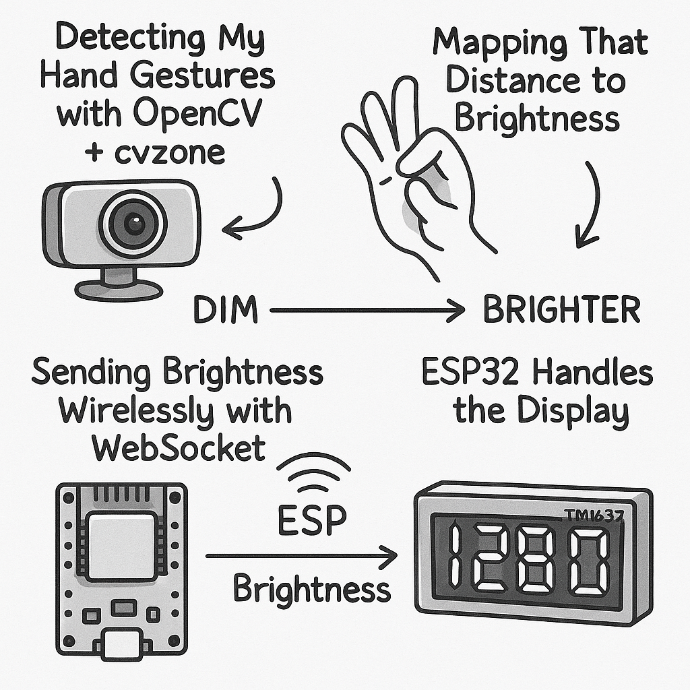

# Handcast Display

**Handcast Display** is a fun and intuitive project that turns your fingers into a wireless brightness controller.

## 🌟 Overview

Using a webcam and OpenCV, this project detects the distance between your thumb and index finger. That distance is mapped to a brightness value (0–255), which is then sent over Wi-Fi to an ESP32 using WebSocket.

The ESP32 receives the brightness and displays it on a TM1637 7-segment display. The display’s own brightness also adjusts to match — no wires, no lag, just smooth gesture control.

## 🧰 What You’ll Need

- GLYPH C6 – WiFi / Zigbee Enabled ESP32C6 DEV Board (or compatible ESP32)
- TM1637 4-digit 7-segment display
- Webcam (laptop or external)
- Jumper wires + breadboard
- Python 3.10+
- Libraries: OpenCV, cvzone, numpy, websocket-client
- Arduino IDE with ESP32 support
<p align="center">
  
</p>

## Dependencies
### ESP32 (Arduino) Libraries
Install the following libraries in the Arduino IDE:

- TM1637Display
- WebSockets
- ESPAsyncWebServer
- AsyncTCP
- WiFi.h *(built-in)*

#### ⚙️ Installation Notes

- Use the **Library Manager** to install `TM1637Display` and `WebSockets`.
- Download `ESPAsyncWebServer` and `AsyncTCP` from GitHub and add them via:
  **Sketch → Include Library → Add .ZIP Library**
  
### 🐍 Python Libraries (PC-side - OpenCV & WebSocket)

Install the following Python libraries using `pip`:

- opencv-python
- cvzone
- numpy
- websocket-client

#### 🛠 Installation Command

```bash
pip install opencv-python cvzone numpy websocket-client
```


## 🧠 How It Works

1. Hand is tracked using OpenCV and cvzone.
2. Distance between thumb and index finger is measured.
3. Value is mapped to brightness (0–255).
4. Value sent to ESP32 via WebSocket.
5. ESP32 shows value on TM1637 and updates its display brightness.
<p align="center">
  
</p>

## 🚀 Getting Started

1. Clone this repo
2. Upload the ESP32 code using Arduino IDE
3. Run the Python script
4. Move your fingers in front of the webcam
5. Watch the display change!

#### Circuit Diagram : 
<p align="center">
  
</p>

## 📂 Code

- `main.py` – Python + OpenCV script
- `control.py` – Sends brightness via WebSocket
- `hand_display.ino` – ESP32 WebSocket + TM1637 code
---

---

## 🙏 Acknowledgements

Huge thanks to **PCB Cupid** for providing the Glyph C6 development board used in this project.  
Working with such a capable and well-documented board made the entire process smooth and enjoyable.

I’m grateful to be part of a team that encourages hands-on experimentation, learning, and creativity.
